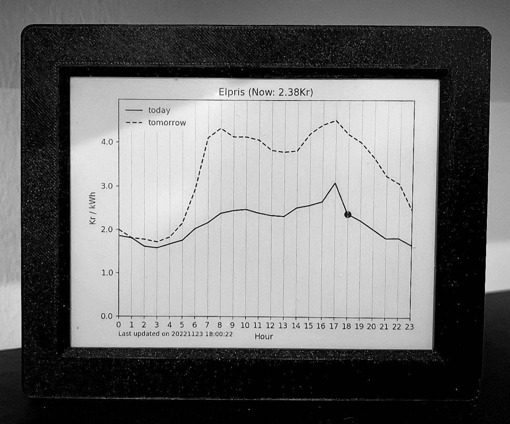

# Electricity Price Screen Project



This is a project to get an Inplate6 screen powered by battery to at predetermined intervals read an graph off of a webserver. The graph is actually an image that is fed to the webserver by a Python script that runs every 5 minutes on a Docker container and gets the latest price info from an API. In my case, I've used the Tibber API to get this data.

The code can be modified to tweak, among other things:

- the refresh interval for the screen
- the interval at which the python script is run
- the provider of the pricing

## Requirements

### Hardware

Here's a list of the hardware I used along with the links to where I bought them:

- [Inkplate6 Screen](https://e-radionica.com/en/inkplate-6-v2-with-enclosure.html)
  - The version I bought (in the link) comes with a 3d printed enclosure.
  - **Interesting fact:** Inkplate screens are made from recycled Kindle screens.
- [Li-ion Battery](https://e-radionica.com/en/li-ion-battery-1200mah.html)
  - There may be others but the one linked is small enough to fit within the closed 3d printed enclosure. Here's [a picture of what it looks like connected](./images/inkplate_and_battery.jpg).
- Raspberry Pi
  - This is used to run the Python script and web server. I use a Raspberry Pi 3B+ that I already had.

### Software

Some of the requirements ont he software side. Other solutions might be available but these are the requirements for the instructions below as they are:

- [Arduino IDE](https://www.arduino.cc/en/software)
- Docker & Docker Compose ([installation instructions for Raspbery Pi](https://dev.to/elalemanyo/how-to-install-docker-and-docker-compose-on-raspberry-pi-1mo))
- NGIX web server (no need to preemptively install this; [the command below](#2-setup-a-web-server-to-serve-your-image) should be enough)
- Inkplate6 board defitions, drivers and libraries for the Arduino IDE (instructions [here](https://inkplate.readthedocs.io/en/latest/get-started.html#arduino))
- If using Tibber as your price provider, you need to generate an API Personal Access token ([instructions are in the "Authorization/Authentication" section here](https://developer.tibber.com/docs/guides/calling-api))

## Files

There are two main sets of files that are needed to get the screen working. They are stored in the two folders within this repo.

### Arduino Files

This folder contains the sketch folder that needs to be imported into the Arduino IDE. Inside there is a file called `arduino_secrets.h.example` that should be filled in with the relevant WiFi information and then renamed to `arduino_secrets.h`.

Some things worth mentioning about the Arduino sketch:

- The sketch is coded to turn on WiFi, fetch the image and refresh the Inkplate6 screen once an hour, on the hour.
- The only exception to the previous point is on hour 13 of the day. Since Tibber makes tomorrow's prices available via their API at varying times after 13:00, the script refreshes the data and screen 3 additional times in that particular hour (`13:15`, `13:30`, `13:45`).
- After doing the refresh the script sets a wakeup "alarm clock", turns off WiFi and other battery consuming processes and sends the Inkplate6 screen into deep sleep. This is the combination that I found to conserve the most energy possible. Using this setup, my "Tibber Screen" can go for between 1 and 2 weeks without charging.

### Python files

This folder contains three files and a folder:

- The `shared` folder is where the output graph of the script will be saved as a PNG image. A sample output is included in the repo but this will be overwritten once the script is run.
- The `tibber_prices.py` file is the actual script that creates the output graph.
- The `auth_secrets.py.example` file should be populated with your Tibber API token and then renamed to `auth_secrets.py`.
- The `Dockerfile` is provided to be able to deploy this Python script as a docker container. This has the benefit that it makes it easy to be restarted on boot or if it errors out.

## Setup

### 1. Setup the Python script

Make sure to read through [this section](#python-files) and modify the `auth_secrets.py.example` file as instructed before continuing.

I use a docker container to deploy the Python script. This is the command I run from the `python_files` folder to build and deploy the container:

```console
docker build -t tibber_prices . && docker run --name tibber_prices -v TibberShared:/shared --restart unless-stopped -d tibber_prices
```

Notice that a `TibberShared` shared volume is created to be able to share the graph image between the Python script and the web server.

### 2. Setup a web server to serve your image

You will need a web server to take your image and expose it to your network. Alternatively, you could user a Samba share or another type of media server but since this was my first time working with an Arduino, I thought this would be the simpler route.

The command I run to deploy the web server:

```console
docker run --name nginx-server -v TibberShared:/usr/share/nginx/html:ro -p 8999:80 --restart unless-stopped -d nginx
```

Notice that we give it access to the same shared volume as the `tibber_prices` container so that it can retrieve the graph image from it.

### 3. Setup the Inkplate6 screen

Make sure to read through [this section](#arduino-files) and modify the `arduino_secrets.h.example` file as instructed before continuing. Then:

1. Set up the required board defitions, drivers and libraries on the Arduino IDE. Follow the instructions [here](https://inkplate.readthedocs.io/en/latest/get-started.html#arduino)
2. Upload the sketch into the Inkplate6 screen
